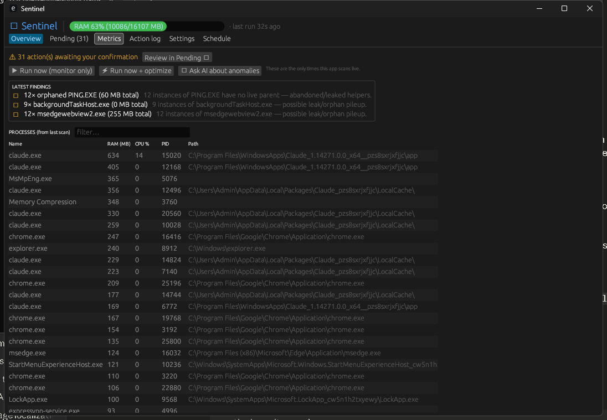
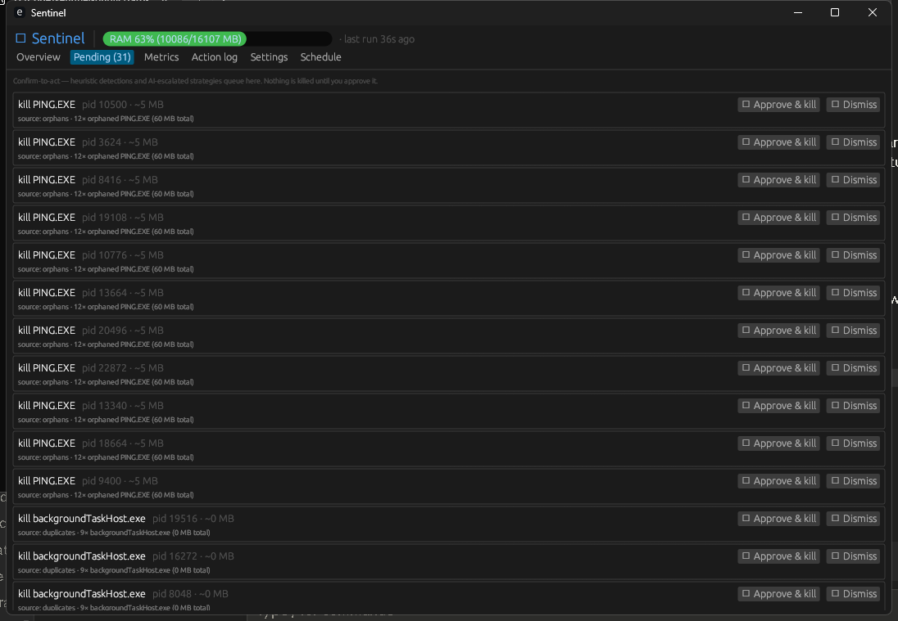
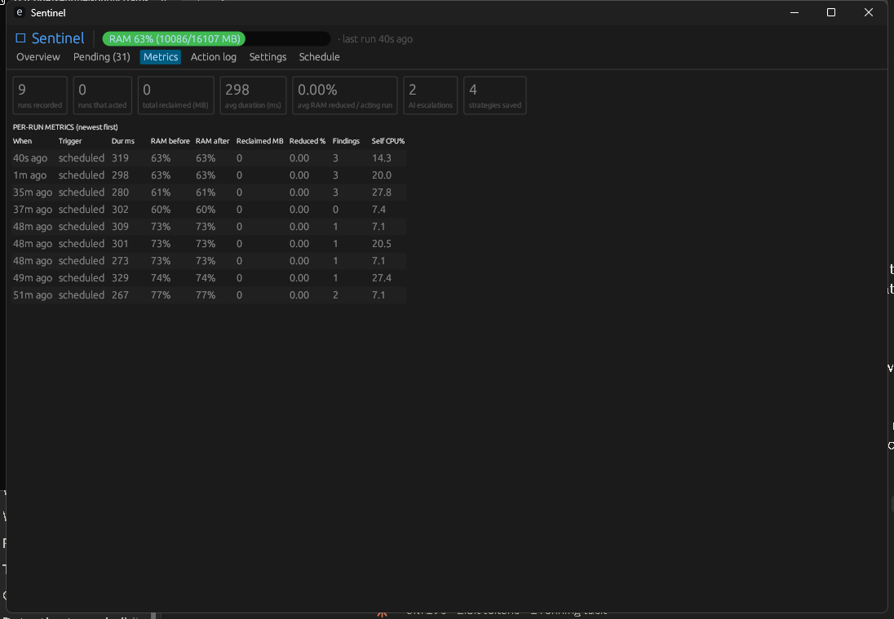
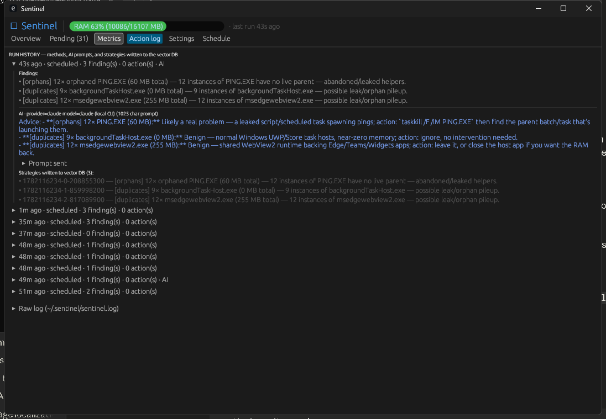
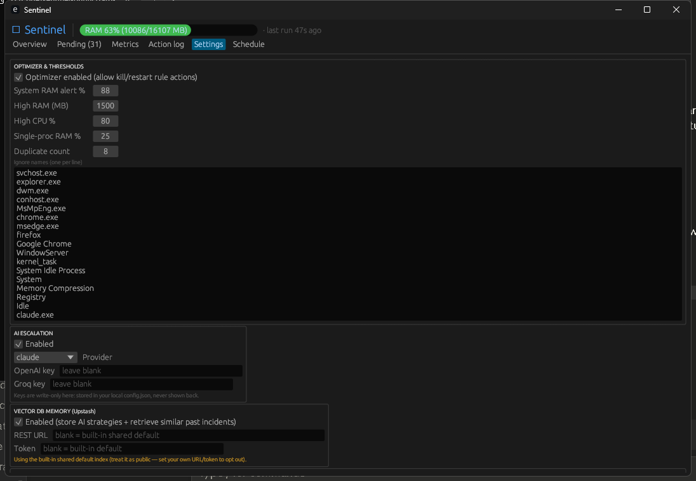
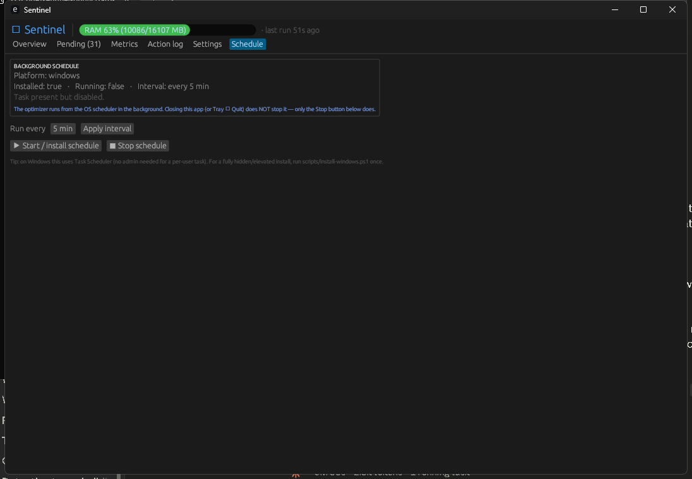

# RAM Optimizer for Windows

**A lightweight RAM optimizer for heavy Claude Code / Claude Desktop users on machines with limited RAM (8–16 GB).** Windows-first (also runs on macOS/Linux — see below).

If you run several Claude sessions at once — multiple `claude` CLI sessions, the desktop app, MCP servers, Node/Python helpers — you have probably watched RAM creep toward 100% while **orphaned** and **duplicate** helper processes pile up and never get reaped. RAM Optimizer watches for exactly that (for **any** app, not just Claude), proposes safe cleanups you confirm, and can reclaim RAM on a schedule so multiple sessions keep running without thrashing.

RAM Optimizer is two small pieces:

1. **A no-daemon background optimizer** — a single native binary (~6 MB, Rust) that the OS scheduler runs once every few minutes (~0.3 s per run, then it fully exits). It detects anomalies, runs your pre-authorized cleanup rules, and writes a record of each run to disk.
2. **A native desktop app** (`ram-optimizer ui`) — a pure-Rust [egui](https://github.com/emilk/egui) window (no browser, no webview, no Electron) that **reads those run records** and shows you metrics, the action log, and pending cleanups to approve. It does **not** monitor in real time, so opening it costs almost nothing — fitting for a tool whose whole job is saving RAM.

> ### 🪟 Primarily for Windows
> RAM Optimizer builds and runs on **Windows, macOS, and Linux**, but it is designed and tuned **Windows-first**:
> - **Windows is usually the heaviest RAM consumer** of the three — its baseline footprint (background services, the shell, and *live antivirus*) leaves the least headroom, so it's where an automatic reclaimer earns its keep.
> - **Several mechanisms are Windows-specific.** The biggest is **live AV taming** — pausing Microsoft Defender's "Antimalware Service Executable" (`MsMpEng.exe`) under RAM pressure when there are no active threats. Also Windows-only: the no-console GUI build, the system-tray icon, the Windows Task Scheduler integration, and the Defender threat query (`Get-MpThreat`).
>
> On **macOS/Linux** the core monitor → detect → reap/relief loop and the dashboard all still work; the Windows-only pieces (AV taming, tray on Linux) are simply no-ops there.

Repo: <https://github.com/game-libgdx-unity/ram-optimizer-for-windows>



---

## Contents

- [Why RAM Optimizer](#why-ram-optimizer)
- [How it works](#how-it-works)
- [The dashboard](#the-dashboard)
- [Install](#install)
- [Detection (generic — any app)](#detection-generic--any-app)
- [Confirm-to-act safety model](#confirm-to-act-safety-model)
- [AI escalation & vector memory](#ai-escalation--vector-memory)
- [Rules](#rules)
- [Configuration reference](#configuration-reference)
- [Metrics](#metrics)
- [Troubleshooting (Windows SAC, SmartScreen & more)](#troubleshooting)
- [Contributing](#contributing)
- [Credits](#credits)
- [License](#license)

---

## Why RAM Optimizer

- **Built for limited RAM.** On 8 GB or 16 GB, a few Claude sessions plus a browser and an editor can tip you into swapping. RAM Optimizer keeps an eye on the pressure and reclaims what's safe to reclaim.
- **Multiple sessions stay healthy.** Detects **duplicate** pileups and **orphaned** helpers (processes whose parent has died) so leaked workers from old sessions don't accumulate.
- **Generic — not Claude-specific.** Every detector works on *any* process on the system. Claude is just the common case that motivated it.
- **The viewer is cheap.** The app reads logs from previous runs; it never runs continuous monitoring, so it won't itself become the thing eating your RAM.
- **You stay in control.** Heuristic and AI-suggested kills are **proposals you confirm** — nothing is killed behind your back. Only the explicit rules *you* write run automatically.

## How it works

```
            ┌──────────────────────────────┐         writes        ┌───────────────────────┐
OS scheduler│ ram-optimizer --once (headless,~0.3s)│ ─────────────────►  │  ~/.ram-optimizer/         │
every N min │  collect → detect → optimize │   run records, log,   │   runs.jsonl          │
            │  → propose → record → exit   │   snapshot, pending   │   snapshot.json       │
            └──────────────────────────────┘                       │   ram-optimizer.log        │
                                                                    │   pending.json        │
            ┌──────────────────────────────┐         reads         └───────────────────────┘
   you open │  ram-optimizer  (native egui app) │ ◄───────────────────────────────┘
            │  metrics · log · approvals   │   (no live scanning)
            └──────────────────────────────┘
```

- **No daemon.** The optimizer is a one-shot: `ram-optimizer --once`. The OS scheduler (Windows Task Scheduler / macOS LaunchAgent / Linux crontab) runs it on an interval; between runs nothing of RAM Optimizer's is resident.
- **Opening the app launches the dashboard.** Running `ram-optimizer` with no arguments (or double-clicking the binary) opens the desktop window **and auto-starts the background schedule** if it isn't already running. The bare headless pass is gated behind `--once` so the scheduled task never pops a window.
- **The schedule is independent of the app.** Closing the dashboard — or quitting it from the tray — does **not** stop the background optimizer. The Schedule tab's **Stop** button does (until the next time you open the app, which re-arms it).
- **The app is a viewer + controller.** It reads the records previous runs wrote and lets you trigger a run, approve pending cleanups, ask the AI, and start/stop/retime the schedule.

## The dashboard

Launch it by running the binary with no arguments (or double-clicking it):

```sh
ram-optimizer        # or: ram-optimizer ui
```

It opens a native window and leaves a **tray icon** while running. Closing the window **minimizes to the tray** (the app keeps running and the background schedule is untouched); the tray menu's **Quit** exits for real, and **Run optimization now** triggers a one-off pass.

| Tab | What it shows |
|---|---|
| **Overview** | System-RAM bar, the latest run's findings, the process table from the last scan, a banner for anything awaiting confirmation, and the manual buttons: *Run now (monitor only)*, *Run now + optimize*, *Ask AI about anomalies*. These buttons are the **only** times the app scans live. |
| **Pending** | Confirm-to-act queue. Proposals are **grouped by app**, so a dozen `msedgewebview2.exe` / `chrome.exe` duplicates collapse into one row with **Approve & kill all (N)** / **Dismiss all** (expand to act on individual PIDs). Each shows the target, why it was proposed, and **Approve & kill** / **Dismiss**. Nothing here runs until you approve it. |
| **Metrics** | Per-run RAM/CPU/duration and effectiveness — how many MB each run reclaimed and the % of RAM reduced — plus aggregates (avg duration, total reclaimed, AI escalations, strategies saved). |
| **Action log** | Run history: the methods used, the **exact AI prompt** sent, the advice returned, and any **new strategies written to the vector DB**. Plus the raw `~/.ram-optimizer/ram-optimizer.log` tail. |
| **Settings** | Edit thresholds, the optimizer switch, ignore-list, AI provider/keys, vector-DB URL/token, and rules (JSON). Secrets are write-only — stored in your local `config.json`, never shown back. |
| **Schedule** | Background-schedule status (platform, installed, running, interval) plus controls: **Trigger run now** (one immediate pass), **Start/Stop**, and the run interval. Opening the app already auto-starts the schedule; this tab is where you stop it or change its cadence. Reminds you the schedule survives the app closing. |

| Pending (confirm-to-act) | Metrics |
|---|---|
|  |  |

| Action log (AI prompt + strategies) | Settings |
|---|---|
|  |  |

| Schedule (start/stop · interval) |
|---|
|  |

## Install

You can install **from source with one command**, or build and use the **setup scripts**.

### Prerequisites

- The **Rust toolchain** (stable) — <https://rustup.rs>.
- A platform C toolchain: **Windows** → MSVC + VS Build Tools ("Desktop development with C++"); **macOS** → Xcode Command Line Tools; **Linux** → `build-essential`/`cc`.
- **Linux only**, GUI build headers for the native window:
  ```sh
  sudo apt-get install -y libxcb-render0-dev libxcb-shape0-dev libxcb-xfixes0-dev \
                          libxkbcommon-dev libgl1-mesa-dev libssl-dev
  ```

### Option A — install by command

```sh
git clone https://github.com/game-libgdx-unity/ram-optimizer-for-windows
cd ram-optimizer-for-windows
cargo install --path .          # builds and installs `ram-optimizer` onto your PATH
cp config.example.json config.json
ram-optimizer                        # open the dashboard (auto-starts the schedule)
```

(Or just `cargo build --release` to get `target/release/ram-optimizer(.exe)` without installing.)

### Option B — build + setup scripts

```sh
cargo build --release           # -> target/release/ram-optimizer(.exe)
cp config.example.json config.json
```

Then register the background schedule (this is the "setup file" step):

**Windows** — registers a hidden `RamOptimizer` scheduled task (self-elevates via UAC):
```powershell
powershell -ExecutionPolicy Bypass -File scripts\install-windows.ps1
# remove later with:  scripts\uninstall-windows.ps1
```

**macOS / Linux** — installs a LaunchAgent (macOS) or crontab entry (Linux):
```sh
bash scripts/install-unix.sh
```

> Prefer to manage the schedule from the GUI? Skip the script and use the **Schedule** tab's *Start / install schedule* button — on Windows that creates a per-user task with **no admin needed**. The script is only required for a fully hidden, elevated install.

### Launch the dashboard

```sh
ram-optimizer             # native window + tray icon (auto-starts the schedule); or `ram-optimizer ui`
```

### CLI (what the scheduler runs)

```sh
ram-optimizer                # open the desktop dashboard (default; also `ram-optimizer ui`)
ram-optimizer --tray         # open it hidden — tray icon only (for launch-at-login)
ram-optimizer --once         # one headless monitoring pass (collect → detect → propose → record)
ram-optimizer --once --print # ...and print findings to stdout
ram-optimizer --once --no-act# ...and never run kill/restart rules (monitor only)
ram-optimizer --dump         # list the top processes by memory (debug)
```

The OS scheduler runs `ram-optimizer --once` every interval (on Windows via `run-hidden.vbs`). On Windows the binary is built as a **GUI app** (`subsystem:windows`), so launching it never opens a console window — you get only the taskbar + tray icon. (Trade-off: `--print`/`--dump` won't echo to a terminal on Windows; the scheduled `--once` logs to `~/.ram-optimizer/cron.log` regardless.)

### Launch the tray app at login (optional)

The background optimizer (the `RamOptimizer` scheduled task) already runs on its own — it does **not** need the app open. If you also want the **dashboard's tray icon** ready at every login *without* a window popping up, register a per-user logon task that runs `--tray` (no admin needed):

```powershell
$exe = "$PWD\target\release\ram-optimizer.exe"   # or wherever ram-optimizer.exe lives
schtasks /Create /TN RAM OptimizerTray /SC ONLOGON /TR "`"$exe`" --tray" /F
```

`--tray` opens the dashboard hidden (tray icon only); open the window from the tray's **Open RAM Optimizer**, and the window **X** hides it back to the tray. Remove it with `schtasks /Delete /TN RAM OptimizerTray /F`.

## Detection (generic — any app)

Every detector runs against **all** processes (subject to your ignore-list); nothing is hard-coded to Claude.

- **System RAM pressure** — overall usage ≥ `systemRamPctAlert`.
- **High RAM** — a process over `highRamMB`, or one eating ≥ `singleProcRamPct` of total RAM (the latter becomes a confirmable kill proposal).
- **Duplicate pileups** — ≥ `dupCount` instances of one process name.
- **Orphan pileups** — ≥ `orphanCount` instances of one name whose **parent process has died** (classic leaked-helper signature). Newest instance is always spared.
- **Memory leaks** — a sizeable process whose RAM climbs by ≥ `memRiseMB` run-over-run.
- **CPU** — sustained-high (across two runs) or sharply-rising (≥ `cpuRisePct`).
- **Antimalware / possible virus** — if Windows Defender's `MsMpEng.exe` ("Antimalware Service Executable") **stays** at high CPU or RAM, RAM Optimizer raises an advisory: brief spikes during scans are normal, but persistently maxed antimalware can mean malware churning your files. It advises a full scan → **Microsoft Defender Offline** scan → update definitions → check Task Manager for unfamiliar processes, and by default it **never** proposes killing the security service. (Opt-in auto-taming is described below.)

### Optional: auto-pause the antimalware service (off by default)

The "Antimalware Service Executable" sometimes pins RAM/CPU for long stretches while merely scanning. If you set `optimize.pauseAntimalwareWhenIdle: true`, the background optimizer will **stop the Defender service to reclaim resources** — but only when **all three** hold in the same pass:

1. system RAM is high (≥ `optimize.antimalwarePauseSystemRamPct`, which defaults to `systemRamPctAlert` — the gentle **non-aggressive** band, e.g. 85%, *not* the aggressive `autoActSystemRamPct`), **and**
2. the antimalware service is running hot right now (≥ `optimize.antimalwareHotRamMB`, or ≥ `highCpuPct`), **and**
3. Defender confirms there are **no active threats** (queried via `Get-MpThreat`).

`antimalwareHotRamMB` defaults to `0`, which means "fall back to `2 × highRamMB`" (≈ 3 GB) — so out of the box only a genuinely bloated Defender qualifies. If you want it tamed at a **smaller** footprint (e.g. Defender sitting at ~300 MB with no threats while you're tight on RAM), set `antimalwareHotRamMB` to a low value like `250`. It still only acts under RAM pressure and never when threats are present.

If Defender reports active threats — or threat status can't be determined — the service is **left running** (fail-safe). Every branch is written to `~/.ram-optimizer/ram-optimizer.log`.

> ⚠️ **This weakens your antivirus.** It is off by default for a reason. Also note that on a stock machine **Windows Tamper Protection** (on by default) blocks stopping `WinDefend` even when elevated — by design, so malware can't disable AV. In that case RAM Optimizer records the real "access denied" result instead of pretending it worked; to make the stop actually take effect you must turn Tamper Protection off and run RAM Optimizer elevated. Windows-only; a no-op on macOS/Linux.

#### Enabling it — the convenient way

Stopping Defender needs **two** OS gates cleared, and neither can be done from code (Windows blocks both so malware can't disable AV). Do this once:

1. **Turn the feature on** in `config.json`:
   ```json
   "optimize": { "pauseAntimalwareWhenIdle": true, "antimalwareHotRamMB": 250, "antimalwarePauseSystemRamPct": 85 }
   ```
2. **Turn off Tamper Protection** *(manual — there is no programmatic way; this is by design)*: **Windows Security ▸ Virus & threat protection ▸ Manage settings ▸ Tamper Protection → Off**. RAM Optimizer can't flip this; if it's on when a pause is attempted, RAM Optimizer writes these exact steps to the Action log so you know what to do.
3. **Run RAM Optimizer elevated — the convenient bit.** Re-register the background task with *highest privileges* so every scheduled pass runs elevated **silently, with no per-run UAC** (you approve UAC just once, at setup):
   ```powershell
   powershell -ExecutionPolicy Bypass -File scripts\install-windows.ps1 -Elevated
   ```
   This is the recommended way to run the optimizer elevated in general — a "Run with highest privileges" scheduled task elevates the background `--once` passes without prompting each time.

After that, whenever RAM is high (≥ `antimalwarePauseSystemRamPct`) and Defender is hot with no active threats, RAM Optimizer stops the service to reclaim its RAM; the next pass leaves it stopped or Windows restarts it as needed.

**Trade-offs to accept:** (a) it genuinely **weakens AV protection**; (b) the elevated task is **admin-owned**, so the non-elevated dashboard can no longer Start/Stop/retime it from the Schedule tab (manage it from an elevated terminal, or re-run the installer **without** `-Elevated` to go back to a per-user task); (c) an elevated optimizer is **more powerful** — it can terminate elevated/system processes too, though the built-in [critical-OS-process floor](#two-tier-ram-policy-gentle-then-aggressive) still protects the essentials.

## Blocking an app

Sometimes you want an app gone and *kept* gone, regardless of RAM. The **🚫 Block** button on the Pending tab (or `optimize.blockNames` in config) adds the process name to a blocklist: every pass, RAM Optimizer kills any process with that name **on sight** — no RAM gate, no restart. Remove the name (edit `blockNames`) to un-block.

> **Can an app be truly prevented from launching?** Only via **admin-level OS mechanisms**, and RAM Optimizer deliberately does **not** ship them on by default:
> - **Image File Execution Options** "debugger" redirect, an **ACL deny-execute** on the exe, or **AppLocker/WDAC** — these genuinely stop a launch, but need admin, can be flagged by AV, and a misaimed rule can block an important app.
> - **Deleting the exe is the wrong tool** — many heavy processes (`msedgewebview2.exe`, `chrome.exe`) are *shared runtimes* other apps depend on, and they're recreated on update/reinstall.
>
> So RAM Optimizer's block is a **soft block**: it can't stop the *first* launch, but it terminates the app within each pass (≈ your schedule interval), reliably and reversibly. The blocklist spares the OS-critical floor and RAM Optimizer itself, so a typo can't brick the machine. If you want a true hard-block (IFEO/ACL) wired in for elevated installs, that can be added as an opt-in.

## Two-tier RAM policy: gentle, then aggressive

You can split the response to system-RAM pressure into two thresholds:

| Tier | Threshold | What happens |
|---|---|---|
| **Gentle** (default) | system RAM ≥ `thresholds.systemRamPctAlert` (example: **85%**) | Advisory finding + OS toast; any single process eating ≥ `singleProcRamPct` becomes a **confirm-to-act proposal** in the Pending tab. **Nothing is killed automatically.** |
| **Reap** (opt-in) | system RAM ≥ `optimize.autoReapSystemRamPct` (`0` = off; example: **85%**) | Auto-reaps **duplicate / orphan / spam pileups** (newest spared). The pileup size that counts is **tier-dependent**: `autoReapCount` (e.g. **10**) in the band below the aggressive threshold, dropping to `autoReapCountAggressive` (e.g. **5**) once RAM hits `autoActSystemRamPct` — so a maxed-out box reaps smaller pileups too. Safe, targeted — only extra instances of one process, never a lone app or the biggest hog. **Claude is guarded** (`optimize.guardClaude`, default on): if a reap touches Claude's process tree and takes it down, RAM Optimizer relaunches it from its captured argv + cwd. ⚠️ **Multi-process apps** (browsers, Electron) have many same-named processes by design — list them in `optimize.noReapNames` so the reaper doesn't mistake them for a pileup and close them (the reap tier **never relaunches** what it prunes). |
| **Aggressive** (opt-in) | system RAM ≥ `optimize.autoActSystemRamPct` (`0` = off; example: **95%**) for `optimize.autoActConfirmPasses` consecutive passes (default **2**) | **Auto-kills the largest eligible process(es)**. Names in `optimize.restartAfterKill` (e.g. `claude.exe`, `node.exe`, `java.exe`) are **relaunched** afterwards (from their captured argv + working dir) so they come back fresh, and **Claude is guarded** here too — if a kill takes it down it's relaunched. |

Order them `autoReapSystemRamPct ≤ autoActSystemRamPct`: get warned, then reap cheap pileups, then — only when genuinely critical — kill the biggest. The aggressive tier:

- only considers processes **≥ ~300 MB** (a smaller kill wouldn't relieve pressure);
- **skips `thresholds.ignoreNames`** — your safety lever. Browsers and OS processes are ignored by default, so they're never auto-killed; **add anything you never want killed** (e.g. `Code.exe`, a database, `java.exe` for your IDE) to this list. Want the biggest hog killed *even if it's a browser*? **Remove it from `ignoreNames`** — e.g. drop `chrome.exe`/`msedge.exe` and the aggressive tier will reclaim from Chrome. You can trim the list all the way to nothing ("no exceptions") safely: a built-in floor of **OS-critical processes** (`svchost.exe`, `lsass.exe`, `WindowServer`, `systemd`, …) is *always* protected in code, regardless of `ignoreNames`, so an empty list can never crash the machine;
- skips the antimalware service and RAM Optimizer itself;
- **keeps Claude alive first** — with `optimize.guardClaude` on (default), Claude's live process tree is never a relief target, so the tier kills the biggest *non-Claude* hog (e.g. Chrome) even when Claude is technically larger. Claude is reclaimed the safe way (the reap tier prunes its leaked duplicate/orphan helpers and relaunches it if needed), not by a brute-force kill;
- kills at most `optimize.autoActMaxKills` processes per pass (default `1`), so each scheduled run trims the single biggest hog and the next run re-checks;
- **relaunches what it kills** if listed in `restartAfterKill` — and a killed *child* of a multi-process app (a `chrome.exe` renderer/GPU process, argv carrying `--type=…`) is relaunched as the **bare executable**, so the app reopens its main window (Chrome restores its session) rather than failing to start a standalone child.

Every auto-kill (and every "nothing eligible to kill") is logged to `~/.ram-optimizer/ram-optimizer.log` and shown in the Action log. It runs only when `optimize.enabled` is `true`.

> ⚠️ **The aggressive tier kills without asking.** It's off by default (`autoActSystemRamPct: 0`). Killing the biggest process can lose unsaved work — curate `ignoreNames` before enabling, and prefer specific `kill`/`restart` rules when you know the culprit.

## Confirm-to-act safety model

Heuristic kills aside, there are two ways something gets killed/restarted **automatically** — both pre-authorized by your `config.json`: your `kill`/`restart` **rules**, and the **aggressive RAM tier** above. Everything else is a proposal. The two non-automatic-vs-automatic paths:

1. **Your config rules** (`action: "kill"` / `"restart"`) — these are *pre-authorized by you*, so the background optimizer runs them automatically when `optimize.enabled` is true. Deterministic, name/path/cmd-matched, system-RAM-gated.
2. **Heuristic detections and AI-escalated strategies** — these are *guesses*, so they **never act on their own**. They enqueue a **proposal** in the **Pending** tab. You click **Approve & kill** (RAM Optimizer re-verifies the PID still maps to the same process, kills it, and logs it) or **Dismiss**. Approved strategies are executed and logged.

That's why opening the app and seeing "31 actions awaiting confirmation" is normal — the background runs *propose*, you *dispose*.

## AI escalation & vector memory

Both are **off by default** (`ai.enabled: false`, `vectordb.enabled: false`).

- **AI escalation** — for novel/abnormal findings, RAM Optimizer can ask an LLM for a one-line diagnosis + best action. Provider is switchable (**default OpenAI**; also **Groq** or the local **`claude`** CLI), with fallback. The prompt and the advice are recorded in the Action log. AI advice never auto-acts — concrete actions land in the Pending queue for you to confirm.
- **Vector memory (RAG)** — when enabled, each escalation is stored as a "strategy" in an [Upstash Vector](https://upstash.com/docs/vector) index, and similar past incidents are retrieved to enrich future prompts. **Reading and writing the remote vector DB is disabled by default** — you opt in on the Settings tab. Strategies are written only to *your own* configured index; the built-in default (below) is **read-only** (retrieval only).

### About the built-in default index

So the vector feature works out of the box, RAM Optimizer ships a **built-in default** Upstash URL + token (used only if you enable vector memory but provide neither your own config values nor the `UPSTASH_VECTOR_REST_URL` / `UPSTASH_VECTOR_REST_TOKEN` env vars).

> **Security note.** The built-in default is **obfuscated, not encrypted** — the key ships in the binary, so anyone can recover it. **Treat the built-in default index as public.** Point `vectordb.url` / `vectordb.token` (or the env vars) at *your own* Upstash index for anything you care about. Credential precedence is: **config → env → built-in default.**

## Rules

`config.json` → `rules` is an array. Each rule:

| Field | Meaning |
|---|---|
| `name` | Label shown in alerts/logs. |
| `match` | `{ "name": "app.exe" }`, `{ "pathContains": "..." }`, and/or `{ "cmdContains": "..." }`. All provided conditions must hold (case-insensitive). |
| `whenProcRamMB` | Fire if a matching process (or, with `group`, the matched total) uses ≥ this many MB. |
| `whenProcCpuPct` | ...or if a matching process is ≥ this CPU%. |
| `whenSystemRamPct` | Only act when overall system RAM is ≥ this percent (`0` = any). |
| `action` | `"alert"` (notify only), `"kill"`, or `"restart"`. |
| `restartCommand` | For `restart`: the argv to launch after killing, e.g. `["C:\\Path\\App.exe"]`. |
| `spareNewest` | When acting on several matches, never touch the most-recently-started one. |
| `group` | Treat the matched set as one: the RAM threshold applies to their sum, and the action hits all. |

`"kill"`/`"restart"` rules run (automatically) only when `optimize.enabled` is `true`. Examples:

```json
{ "name": "alert-big-app", "match": { "name": "SomeApp.exe" }, "whenProcRamMB": 2000, "action": "alert" }
```
```json
{ "name": "kill-runaway-worker", "match": { "cmdContains": "worker.js" },
  "whenProcRamMB": 1500, "whenSystemRamPct": 95, "action": "kill", "spareNewest": true }
```

## Configuration reference

`config.json` holds your keys and is **gitignored** — copy `config.example.json` to start.

- `thresholds.*` — `systemRamPctAlert`, `highRamMB`, `singleProcRamPct`, `highCpuPct`, `cpuRisePct`, `dupCount`, `orphanCount`, `memRiseMB`, `ignoreNames`.
- `optimize.enabled` — master switch for automatic `kill`/`restart` **rule** actions (does not affect confirm-to-act proposals).
- `optimize.autoActSystemRamPct` — aggressive tier: at/above this system-RAM% the optimizer auto-kills the largest eligible process(es) without confirmation. `0` disables (default). Keep it **above** `thresholds.systemRamPctAlert`. See [Two-tier RAM policy](#two-tier-ram-policy-gentle-then-aggressive).
- `optimize.autoActMaxKills` — max processes the aggressive tier kills per pass (default `1`).
- `optimize.autoActConfirmPasses` — hysteresis for the aggressive tier: how many **consecutive** passes RAM must stay ≥ `autoActSystemRamPct` before the no-confirmation kill fires (default `2`). With a 5-min schedule, `2` means RAM must be critical for ~10 min, so a brief spike is ignored; `1` acts on the first critical pass. Does not affect the reap tier.
- `optimize.autoReapSystemRamPct` — reap tier: at/above this system-RAM% auto-reap duplicate/orphan/spam pileups (newest spared). `0` disables (default). Keep it ≤ `autoActSystemRamPct`.
- `optimize.autoReapCount` / `optimize.autoReapCountAggressive` — min instances of one name to reap, below vs at/above the aggressive threshold (defaults `10` / `5`). Applies to both duplicates and orphans.
- `optimize.noReapNames` — process names the **reap tier never touches** (but the aggressive relief tier still can). Use it for legitimate **multi-process apps** — browsers (`chrome.exe`, `msedge.exe`, `msedgewebview2.exe`), Electron apps — whose dozen-plus same-named processes are normal architecture, *not* a leaked pileup. Without this, the reaper treats them as a "duplicate pileup" and kills all-but-newest (which kills the **main** process and closes the app), and **the reap tier never relaunches what it prunes** — `restartAfterKill` only applies to the aggressive tier. Empty by default in your config; the example ships the common browsers. See [Two-tier RAM policy](#two-tier-ram-policy-gentle-then-aggressive).
- `optimize.blockNames` — process names to **kill on sight every pass** (a soft "block" for apps you never want running). RAM Optimizer can't truly stop an app from launching without admin OS policies (see [Blocking an app](#blocking-an-app)), so it instead terminates any match on every run, regardless of RAM, and never relaunches it. Bypasses `ignoreNames`/`noReapNames` (explicit intent) but still spares the OS-critical floor and RAM Optimizer itself. Add via the Pending tab's **🚫 Block** button or edit this list; remove a name to un-block. Empty (default) = nothing blocked.
- `optimize.restartAfterKill` — process names the aggressive tier **relaunches** after killing (from their captured argv + cwd), e.g. `["claude.exe","node.exe","java.exe"]`. Use `["*"]` to relaunch **every** app the aggressive tier kills (so `chrome.exe`, or any other app, reopens after it's killed to relieve pressure). Empty (default) = never restart. Note: this is the *aggressive* tier only — the reap tier never relaunches the duplicate/orphan copies it prunes (that's the point of reaping), and it always spares the newest instance so the app itself stays alive.
- `optimize.guardClaude` — default `true`. Keeps Claude alive across the optimizer's automatic kills, two ways: **(1) protect** — Claude's live process tree (every Claude instance plus its live ancestors/descendants) is never chosen as an aggressive-relief target, so the tier kills other hogs (e.g. Chrome) first and keeps Claude up as long as possible; **(2) relaunch** — if a reap/relief kill still takes Claude's tree down, re-check right after the kills whether *any* Claude is alive and, if not, relaunch it from its captured argv + cwd (the *any*-live check means `restartAfterKill` bringing it back won't cause a second copy). Identifies Claude via `claudeMarkers`. Set `false` to disable both.
- `optimize.claudeMarkers` — case-insensitive markers that identify a Claude process for `guardClaude`, matched against the process **name** AND its **command line / exe path** — so both the native `claude.exe` and a `node.exe` running Claude Code are recognized. Default `["claude"]`; empty disables the guard.
- `optimize.pauseAntimalwareWhenIdle` — opt-in (default `false`); stop Microsoft Defender's service under RAM pressure **only** when it's running hot and Defender confirms no active threats. Weakens AV; blocked by Tamper Protection unless disabled + elevated. Windows-only. See [the section above](#optional-auto-pause-the-antimalware-service-off-by-default).
- `optimize.antimalwareHotRamMB` — RAM (MB) at/above which Defender counts as "hot enough to tame" for the option above. `0` (default) = `2 × highRamMB` (≈ 3 GB). Set low (e.g. `250`) to reclaim Defender's RAM at a modest footprint; still gated on RAM pressure + no active threats.
- `optimize.antimalwarePauseSystemRamPct` — system-RAM% at/above which Defender may be tamed. `0` (default) falls back to `thresholds.systemRamPctAlert` (the gentle **non-aggressive** band). This is deliberately independent of the aggressive tier and its hysteresis, so Defender can be paused at the lower 85%-style threshold without waiting for `autoActSystemRamPct`.
- `ai.*` — `enabled`, `provider` (`openai` *(default)* | `groq` | `claude`), `fallback`, API keys/models, `minMinutesBetweenEscalations`.
- `alerts.*` — `toast` (OS notifications — set `false` to silence all toasts, incl. reclaim notices; toggle in Settings ▸ Notifications & window), `log`, `cooldownMinutes`, `onlyUnderRamPressure` (default `false`; when `true`, toasts are shown **only** when system RAM is at/above `thresholds.systemRamPctAlert` — so per-process / CPU / antimalware findings don't pop a notification while RAM is fine. Findings are still recorded to the log + dashboard).
- `vectordb.*` — `enabled` (off by default), `provider` (`upstash`), Upstash `url` + `token` (blank = built-in read-only default), `topK`.
- `ui.*` — `enabled`, `bind`, `port` (reserved for future use), `startHidden` (default `false`; when `true`, launching the app starts it hidden in the tray instead of showing the window — `ram-optimizer ui` still forces it open, `--tray` always starts hidden).
- `schedule.*` — `intervalMinutes`, `taskName`, `keepRuns` (how many run records to retain).

## Metrics

Every run appends a compact record to `~/.ram-optimizer/runs.jsonl`: duration, RAM before/after, **MB reclaimed**, **% of RAM reduced**, RAM Optimizer's own CPU%, process count, findings, actions, AI prompt/advice, and strategies saved. The **Metrics** tab renders per-run rows plus aggregates so you can see how effective each optimizing iteration was and how cheap it is to run (typically ~0.3 s and a few % CPU).

## Troubleshooting

### Windows: Smart App Control (SAC) blocks the app

Windows 11's **Smart App Control** blocks unsigned/untrusted binaries — a self-built `ram-optimizer.exe` is unsigned, so SAC may silently refuse to launch it.

- Check status: **Windows Security ▸ App & browser control ▸ Smart App Control settings**.
- SAC has three states: **On**, **Evaluation**, **Off**. It **cannot allow-list a single app** — by design.
- Options, least-drastic first:
  1. **Build it yourself** (you already trust your own toolchain) and run from your user profile — SAC is more permissive for locally-built code than for downloaded executables, but may still block. If it does:
  2. **Sign the binary** with a code-signing certificate you own, then it runs under SAC.
  3. **Turn SAC off** (App & browser control ▸ Smart App Control settings ▸ *Off*). ⚠️ Once turned **off**, SAC **cannot be turned back on** without resetting/reinstalling Windows — decide deliberately.

### Windows: SmartScreen "Windows protected your PC"

For a locally-built exe this is usually just **SmartScreen**, not SAC. Click **More info ▸ Run anyway**. To avoid it on the scheduled task, the installer runs the binary directly (no download-mark), so SmartScreen typically won't re-prompt.

### Windows: the scheduled task needs admin / runs hidden

`scripts\install-windows.ps1` registers a hidden task. By **default it's a per-user task that needs no admin**, so the dashboard (which runs non-elevated) can Start/Stop/retime it from the **Schedule** tab. Pass `-Elevated` to register an admin (RunLevel Highest) task instead — but then the non-elevated dashboard **can't change its schedule** (`schtasks` returns "Access is denied"); to manage it again, delete it from an elevated terminal (`schtasks /Delete /TN RamOptimizer /F`) and reopen RAM Optimizer so it re-installs per-user. The Schedule tab's *Start / install schedule* button always creates the per-user task.

### `provider: "claude"` doesn't return advice on Windows

RAM Optimizer launches the `claude` CLI through `cmd /C` (so the `claude.cmd` npm shim resolves) and feeds the prompt on stdin. Make sure `claude` works in a normal terminal first (`claude -p "hi"`). If you installed Node/npm after RAM Optimizer, restart so PATH is fresh.

### Antivirus flags `ram-optimizer.exe`

A small Rust binary that enumerates processes and can terminate them is a common false-positive shape. It makes no network calls unless you enable AI/vector features. Add an exclusion for your built binary if needed, or build from source so you control the artifact.

### No toast notifications

Toasts use the OS notifier (Windows balloon / `osascript` / `notify-send`). On Linux install `libnotify-bin`. Check `alerts.toast` is `true` and that Focus Assist / Do Not Disturb is off.

### Linux: the app won't build or start

Install the GUI dev headers listed under [Prerequisites](#prerequisites). The tray icon is omitted on Linux (it needs GTK); the app still runs, just without a tray.

### Known issue: `--tray` (hidden window) can spin a CPU core

When the dashboard runs hidden in the tray (the `--tray` / launch-at-login path), eframe's glow renderer can busy-loop redrawing the invisible window and peg ~one CPU core. This is a renderer/windowing limitation below the app layer (gating repaints / throttling the update loop doesn't help, since the spin isn't in our per-frame code). **The background optimizer is unaffected** — it runs from the OS scheduler (`ram-optimizer --once`) completely independently of any window. If you hit this, **don't run the always-open tray**: rely on the scheduled monitor and open the dashboard on demand with `ram-optimizer.exe` (or `ram-optimizer ui`) when you want to look at it. Disable a launch-at-login tray task with `schtasks /Change /TN RAM OptimizerTray /DISABLE`.

## Contributing

Ideas, issues, and PRs are very welcome — see **[CONTRIBUTING.md](CONTRIBUTING.md)**. Good first contributions: new detectors, more platform-accurate scheduler integration, or UI polish. Please open an issue to discuss larger changes first.

## Credits

Created and maintained by **[@game-libgdx-unity](https://github.com/game-libgdx-unity)** — <https://github.com/game-libgdx-unity/ram-optimizer-for-windows>.

Built with [sysinfo](https://crates.io/crates/sysinfo), [eframe/egui](https://github.com/emilk/egui), [tray-icon](https://crates.io/crates/tray-icon), and [reqwest](https://crates.io/crates/reqwest).

## License

MIT — see [LICENSE](LICENSE).
